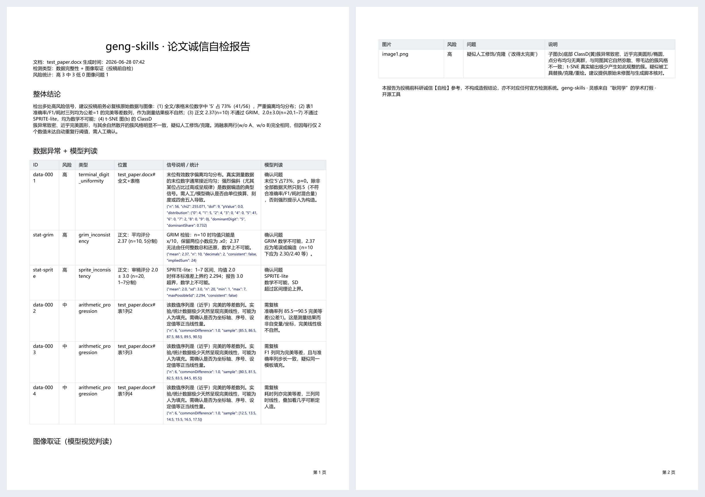

# geng-skills

> 论文投稿前的**科研诚信自检** skill — 在被别人打假之前，先用同样的方法检查自己的论文。
>
> 灵感来自["耿同学"的学术打假](https://zhuanlan.zhihu.com/p/2040725903106385012)。
> "耿"既是致敬，也取**耿直**之意。本工具面向作者本人自查，**不教任何人掩盖造假**。

支持 **LaTeX**（`.tex` / 工程目录）与 **Word**（`.docx`），从两个方向检查常见造假信号，最终导出 **PDF 报告**：

- **数值数据异常**：末位数字分布、Benford 定律、完美等差数列、重复数据块、重复行、GRIM 均值自洽、SPRITE-lite 标准差可能性。
- **图像 PS 痕迹**：抽取全部图片 + sha1 完全重复检测 + **"一图多用"引用计数** + 缩略图拼版，由 **AI 模型用视觉能力**判读复制重用、拼接、克隆/涂抹等痕迹（不依赖任何 CV 库）。

> 设计哲学（与 [ai-check-skills](https://github.com/HoneyMeta/ai-check-skills) 一致）：
> **确定性脚本只筛信号，AI 模型负责判读**，以避免误报。脚本不下"造假"结论。

## 报告示例



> 自动导出 PDF：风险分级表（数据异常 + 模型判读）、图像取证表、整体结论与免责声明。
> 上图为对一份含人造数据 + 修饰过的 t-SNE 图的测试稿生成的报告。

## 为什么是 skill 而不是普通脚本

耿同学的工作流本质就是"**确定性统计/查重筛信号 + 人判断**"。这与 AI agent skill 的范式完全吻合：
脚本抽数据、跑统计、抽图片 → 模型判读（含看图）→ 生成报告。把它产品化、前置到投稿前，就是本 skill。

## 安装

本 skill 面向 AI 编程助手（Claude Code / Codex / OpenCode / Cursor / GitHub Copilot 等）。
推荐用通用的 skills 安装器：

```bash
npx skills add HoneyMeta/geng-skills
```

或者直接对你的 AI 说：

> **安装 https://github.com/HoneyMeta/geng-skills 这个技能**

AI 会把本仓库拉取到它的 skills 目录。可选增强依赖（图片处理 + PDF 报告 + PDF 矢量图预览）：

```bash
pip install -r requirements.txt   # Pillow（图片）、reportlab（PDF）、PyMuPDF（可选）；缺失会自动降级
```
> 数据检查零依赖即可运行（Python 3.9+，docx 用标准库解析）。

## 使用

安装后，把论文（`.docx` / `.tex` / LaTeX 工程目录）交给 AI，然后说：

> **使用 geng-skills 这个技能** 检查我这篇论文有没有数据/图像造假风险

AI 会按技能流程自动：抽数据跑取证统计 → 抽图片并用视觉判读 PS 痕迹 → 生成 PDF 报告。

<details>
<summary>手动运行底层脚本（一般无需，AI 会自动调用）</summary>

```bash
# 1) 数据取证
python scripts/geng_check.py data   --input paper.tex  --out findings.json
# 2) 抽取图片（之后由 AI 看图判读）
python scripts/geng_check.py images --input paper.docx --out-dir extracted_images --contact-sheet
# 3) GRIM / SPRITE-lite（按需）
python scripts/geng_check.py grim   --mean 3.45 --n 20 --decimals 2          # 多题量表加 --items 5
python scripts/geng_check.py sprite --mean 2.0 --sd 3.0 --n 20 --min 1 --max 7
# 4) 生成报告（合并 AI 判读 verdicts.json）
python scripts/geng_check.py report --findings findings.json --verdicts verdicts.json --out report.pdf
```
</details>

完整工作流、判读尺度与各检查项含义见 [SKILL.md](SKILL.md) 与 [references/](references/)。

## 输出

- `findings.json` — 数据信号（type / severity / location / stat / explanation）。
- `extracted_images/` + `manifest.json` — 全部图片、尺寸、sha1、引用次数、完全重复分组（`exactDuplicateFiles`）、
  一图多用（`reusedImages`）、缩略图拼版；LaTeX 的 PDF 矢量图另有 `*.preview.png`。
- `report.pdf`（或降级 `report.html`）— 风险分级表 + 图像判读 + 整体结论 + 免责声明。

## 检查项一览

| 方向 | 检查 | 信号 |
|---|---|---|
| 数据 | 末位数字均匀性 | 卡方偏离（如 2400 个末位全 5）；小样本用精确二项检验 |
| 数据 | Benford 首位数字 | 跨数量级数据的首位偏离 |
| 数据 | 等差数列 | 测量列呈完美线性 |
| 数据 | 重复数据块 / 行 | 跨样本复制粘贴（"均值 ± SD"中的 SD 也参与比对） |
| 数据 | 小数位异常不一致 | 同列精度混杂（弱信号） |
| 数据 | GRIM | 报告均值数学上不可能（支持多题量表） |
| 数据 | SPRITE-lite | 有界数据的报告标准差超理论上界 |
| 图像 | 完全重复文件 | sha1 一致（脚本自动） |
| 图像 | 一图多用 | 同一图片文件在文中插入多次（脚本自动，docx 靠引用计数） |
| 图像 | 复制/拼接/克隆/涂抹 | AI 视觉判读 |

## 限制

- 图像仅做**篇内**比对，不做跨论文/全库比对（需外部数据库）。
- 依赖能从表格 / `tabular` 解析出数值；图片里的数据无法读取。
- 所有结论需人工/模型确认；本工具只提供线索与报告，**不构成造假认定**，也不对应任何官方检测系统。

## License

MIT
